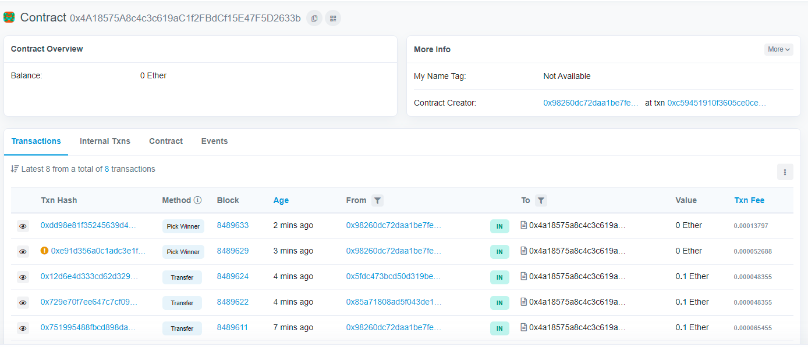

Transaction Hash
0xc59451910f3605ce0cee05bdb30a4316f7e6f47fcc56a386cdbd42925e9bf435

### Contract address

### 0x4A18575A8c4c3c619aC1f2FBdCf15E47F5D2633b

# Lottery Smart Contract

### Lottery algorithm

- The lottery starts by accepting ETH transactions. Anyone having an Ethereum wallet can send a fixed amount of 0.1 ETH to the contract's address.
- The players send ETH directly to the contract address and their Ethereum address is registered. A user can send more transactions having more chances to win.
- There is a manager (The account that deploys and controls the contract)
- At some point, if there are at least 10 players, anyone can pick a random winner from the players list. Only the manager is allowed to see the contract balance and to randomly select the winner.
- the contract will transfer the entire balance to the winner's address, the manager will also receive a 10% fee of the contracts balance, once a winner is picked the lottery is reset and ready for the next round.

  Made by Antonio Salazar.
